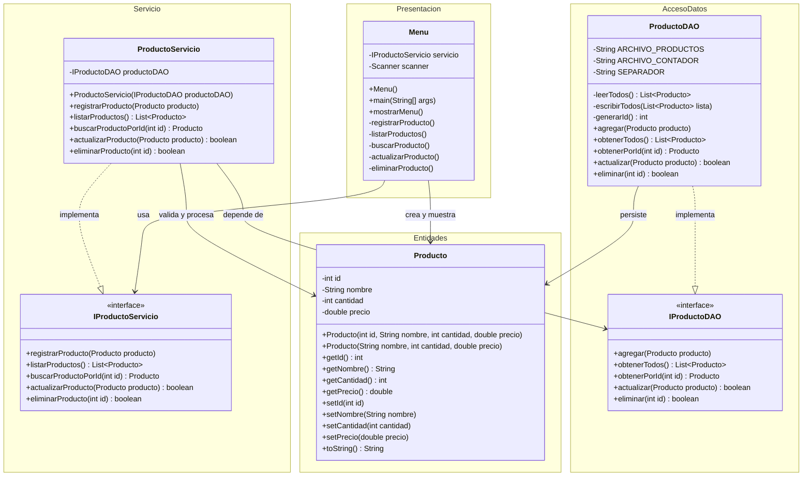

# Diagrama de Clases UML - Sistema de Inventario

## Vista general

El siguiente diagrama representa las capas reales del proyecto, sus relaciones y las interfaces implementadas.

## Lectura del diagrama por capas

### Capa de Presentacion

- `Menu` interactua con el usuario.
- Depende de la interfaz `IProductoServicio`, no de una implementacion concreta.

### Capa de Servicio

- `ProductoServicio` implementa la logica de negocio.
- Depende de `IProductoDAO` para acceder a los datos.

### Capa de Acceso a Datos

- `ProductoDAO` implementa el contrato `IProductoDAO`.
- Administra la lectura y escritura en archivos de texto.

### Capa de Entidades

- `Producto` es la entidad compartida entre las demas capas.

## Relaciones correctas identificadas

- `Menu` usa `IProductoServicio`.
- `ProductoServicio` implementa `IProductoServicio`.
- `ProductoServicio` usa `IProductoDAO`.
- `ProductoDAO` implementa `IProductoDAO`.
- `Producto` es usado por presentacion, servicio y acceso a datos como objeto de transferencia.

## Interfaces

En el proyecto si aplican interfaces y son parte importante del diseno:

- `IProductoServicio`
- `IProductoDAO`

Estas interfaces ayudan a desacoplar las capas y hacen que la implementacion concreta pueda cambiar con menor impacto.

## Uso de IA (obligatorio documentar)

### Estado actual en el codigo

Despues de revisar el proyecto, no se identificaron clases, interfaces, servicios externos ni librerias relacionadas con inteligencia artificial dentro de la implementacion actual.

Eso significa que:

- La IA no participa en el registro de productos.
- La IA no participa en busquedas o recomendaciones.
- La IA no interviene en la persistencia de datos.

### Interpretacion arquitectonica

En el UML del sistema no se agrego una clase de IA porque no existe una dependencia real de ese tipo en el codigo fuente. Agregarla al diagrama produciria una representacion incorrecta de la arquitectura actual.

### Forma correcta de documentarlo

La manera correcta de cumplir con este requisito es dejar constancia explicita de que:

- El sistema actualmente no integra modulos de IA.
- El uso de IA, si existio durante el desarrollo, fue externo al sistema y no forma parte de su ejecucion.

## Archivos fuente relacionados

- [Menu.java](C:\Users\ekaro\OneDrive\Documentos\NetBeansProjects\Progra II\Sistema Inventario\src\Presentacion\Menu.java)
- [ProductoServicio.java](C:\Users\ekaro\OneDrive\Documentos\NetBeansProjects\Progra II\Sistema Inventario\src\Servicio\ProductoServicio.java)
- [IProductoServicio.java](C:\Users\ekaro\OneDrive\Documentos\NetBeansProjects\Progra II\Sistema Inventario\src\Servicio\IProductoServicio.java)
- [ProductoDAO.java](C:\Users\ekaro\OneDrive\Documentos\NetBeansProjects\Progra II\Sistema Inventario\src\AccesoDatos\ProductoDAO.java)
- [IProductoDAO.java](C:\Users\ekaro\OneDrive\Documentos\NetBeansProjects\Progra II\Sistema Inventario\src\AccesoDatos\IProductoDAO.java)
- [Producto.java](C:\Users\ekaro\OneDrive\Documentos\NetBeansProjects\Progra II\Sistema Inventario\src\Entidades\Producto.java)
